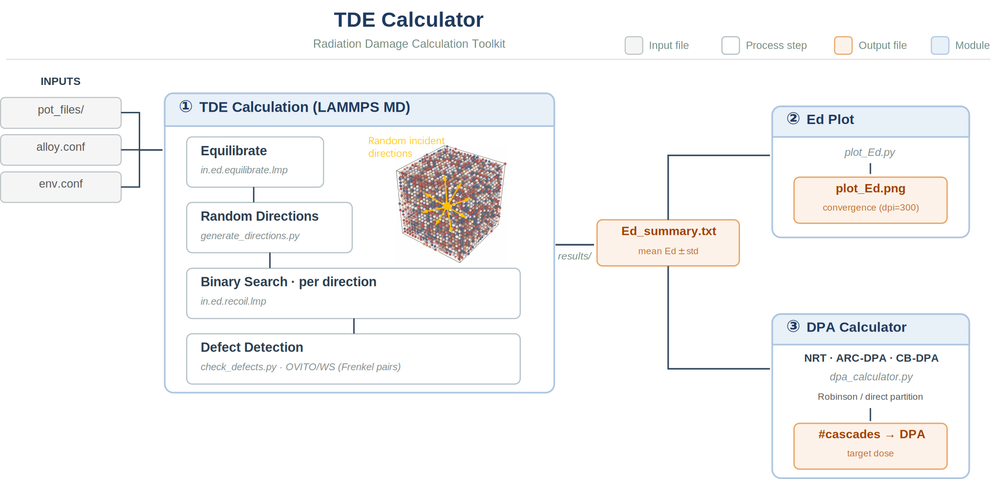
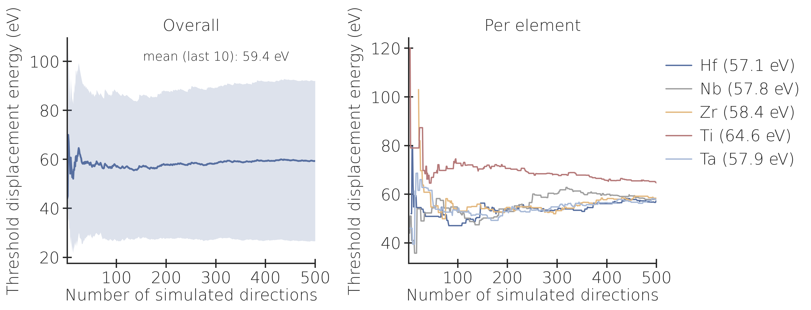

# TDE Calculator

**Threshold displacement energy + DPA calculator for alloy materials**

An integrated toolkit that combines **LAMMPS molecular dynamics** (Byggmästar knock-on atom method) for threshold displacement energy (TDE) calculation, **convergence visualization**, and **DPA-to-cascade conversion** (NRT / ARC-DPA / CB-DPA analytical models).



[](https://python.org)[](https://lammps.sandia.gov)[]()[](ReadMe_zh.md)

---

## Quick Start

```bash
# 1. Launch the program
python3 main.py

# 2. Configure environment paths (menu option 9)
#    → Set mpirun path and LAMMPS executable path (e.g., lmp_mpi)

# 3. Clean old results (menu option 4) — optional

# 4. Run TDE calculation (menu option 1)
#    → Enter elements → select potential → choose auto/custom config
#    → Set parameters → confirm → LAMMPS runs

# 5. Plot Ed convergence (menu option 2)
#    → Select a results directory → plot_Ed.png saved

# 6. Calculate DPA-to-cascade (menu option 3)
#    → Choose model: NRT / ARC-DPA / CB-DPA

# 7. Exit (menu option 0)
```

---

## Directory Structure

```
TDE_calculator/
├── main.py                     Menu-driven entry point
├── ReadMe.md                   This file
├── env.conf                    Environment config (mpirun & LMP paths)
├── pot_files/                  Place .zbl potential files here
├── custom_data_files/          Custom data files for "custom" config source
├── results/                    Ed calculation output (generated)
├── Ed_summary.txt              Statistics summary (generated)
│
├── Ed_calc/                    TDE calculation (LAMMPS MD)
│   ├── run_Ed.sh               Master shell script (multi-config, parallel)
│   ├── alloy.conf              Alloy parameters (generated by main.py)
│   ├── in.ed.equilibrate.lmp   LAMMPS equilibration
│   ├── in.ed.recoil.lmp        LAMMPS knock-on atom recoil
│   ├── check_defects.py        OVITO Wigner-Seitz defect analysis
│   ├── collect_results.py      Element-resolved statistics
│   └── generate_directions.py  Random unit vector generation
│
├── Ed_plot/                    Plotting template
│   └── plot_Ed.py              Convergence plot (1×2 subplot)
│
└── DPA_calc/                   DPA analytical calculator
    └── dpa_calculator.py       NRT / ARC-DPA / CB-DPA + Robinson partition
```

---

## Menu Options

```
============================================================
  TDE Calculator v0.3.0
  Radiation Damage Calculation Toolkit
============================================================
  1. TDE Calculation  (Ed_calc, LAMMPS MD)
  2. Plot Ed         (Ed_plot, convergence)
  3. DPA Calculator  (NRT / ARC-DPA / CB-DPA)
  4. Clean Up        (remove all generated files)
  9. Environment     (set mpirun & LAMMPS paths)
  0. Exit
============================================================
```

---

### 1. TDE Calculation

A **5-step interactive setup** configures the material, potential, and simulation parameters before launching LAMMPS.

#### Step 1: Elements
Enter element symbols (space-separated). Masses are auto-looked up from a built-in periodic table.

```
Elements [Hf Nb Zr Ti Ta]: W Ta Cr V
→ Auto-looked up: 183.840 180.948 51.996 50.942
```

#### Step 2: Potential
Select a potential file from `pot_files/` (EAM/alloy format) by number.

#### Step 3: Configuration
- `auto` = program generates a random solid solution (BCC or FCC lattice).
  Single element → pure metal; multiple elements → equiatomic random alloy.
- `custom` = user provides data files (`custom_data_files/data.1`, `.2`, ...).
  (Only BCC and FCC are supported in `auto` mode; use `custom` for other structures.)

Prompts for crystal structure (`bcc` / `fcc`) and lattice constant (Å).

> **Note:** Only **orthogonal** simulation boxes are supported. For non-orthogonal crystal systems, use tools like atomsk to cut an orthogonal supercell and place the data file in `custom_data_files/`.


#### Step 4: Simulation Parameters

| Parameter | Default | Description |
|-----------|---------|-------------|
| **NCORE** | 16 | CPU cores per `mpirun` job |
| **NJOB** | 4 | Concurrent directions (total cores = NJOB × NCORE) |
| **NCONFIG** | 5 | Independent random configurations |
| **NDIR_PER_CONFIG** | 100 | Crystal directions sampled per config |
| **SIMTIME** | 6.0 ps | Simulation time per energy attempt |
| **EMIN** | 10 eV | Lower bound of binary search energy range |
| **EMAX** | 180 eV | Upper bound of binary search energy range |
| **ESTEP** | 1 eV | Energy resolution (tested energies quantized to multiples) |
| **TEMP** | 40 K | Simulation temperature (low T reduces thermal noise) |
| **DEFECT_METHOD** | ovito | Defect detection algorithm (`displace` / `cna` / `ptm` / `ovito`) |

#### Step 5: Confirm
Displays a summary and runs `run_Ed.sh` after confirmation.

**Output**: `results/config_*/Ed_direction_*.txt`, `Ed_summary.txt`.

---

### 2. Plot Ed Convergence

Scans `results/` for `config_*/Ed_direction_*.txt`, runs `plot_Ed.py` in the selected directory. Produces a 1×2 subplot: overall cumulative mean (left) and per-element mean (right).

**Output**: `plot_Ed.png` (dpi=300).

### 3. DPA Calculator

Launches `dpa_calculator.py` in interactive mode (`-i`). Supports NRT, ARC-DPA, and CB-DPA models with direct or Robinson energy partition.

### 4. Clean Up

Removes all generated files (`results/`, `logs/`, `dump_files/`, `Ed_summary.txt`, `rss_substitute.lmp`, etc.). Preserves source code, `pot_files/`, and `custom_data_files/`.

### 9. Environment

Sets `mpirun` and LAMMPS executable paths. Saved to `env.conf`.

---

## Customizing the Simulation

### Changing the Model Size

The number of atoms in `auto` mode is controlled by `Nsize` in `Ed_calc/in.ed.equilibrate.lmp` (line 30):

```lammps
variable Nsize equal 16    # BCC: 16³×2 = 8192 atoms; FCC: 16³×4 = 16384 atoms
```

To create a larger model, edit this line:

```lammps
variable Nsize equal 20    # BCC: 20³×2 = 16000 atoms
```

### Changing the Pair Style (Potential Type)

The current default pair style is **EAM/alloy**. To switch to a different potential type (e.g., MEAM), edit two files:

1. `Ed_calc/in.ed.equilibrate.lmp` (lines 47–48):

```lammps
# Default (eam/alloy) — change pair_style and adjust pair_coeff as needed:
pair_style      eam/alloy
pair_coeff      * * ${POTENTIAL} ${ELEMENTS}
```

2. `Ed_calc/in.ed.recoil.lmp` (lines 34–35):

```lammps
# Same change must be applied here:
pair_style      eam/alloy
pair_coeff      * * ${POTENTIAL} ${ELEMENTS}
```

---

## Defect Detection Methods

Four methods are available via the `DEFECT_METHOD` parameter. Each determines whether the PKA energy created a stable Frenkel pair.

| Method | Key Parameter | Default | Typical Ed | Notes |
|--------|--------------|---------|------------|-------|
| **displace** | Displacement threshold | 1.0 Å | **Lower** | Over-sensitive; flags replacement collisions as defects |
| **CNA** | Cutoff radius | 3.5 Å | — | **Not recommended** for multi-element alloys |
| **PTM** | RMSD threshold | 0.1 | Similar to OVITO | Reliable for BCC/FCC; noise-resistant |
| **OVITO/WS** | Direct Frenkel pair count | — | **Standard** | Most accurate; requires OVITO (`ovitos`) |

### Detailed Comparison

- **displace** (1.0 Å threshold, `in.ed.recoil.lmp:120`): Counts atoms displaced >1.0 Å from their initial positions. This is the most sensitive method — it flags **replacement collision sequences** (atoms moving to neighboring sites without creating vacancies/interstitials) as DEFECT, producing a **systematically lower** TDE than other methods. Useful for fast preview runs.

- **CNA** (3.5 Å cutoff, `in.ed.recoil.lmp:130`): Common Neighbor Analysis identifies atoms whose local structure does not match the expected crystal type (BCC=3, FCC=1). **Not recommended** for multi-element random solid solutions, because chemical disorder alone can cause CNA to flag pristine atoms as defective. The 3.5 Å cutoff covers the first-nearest-neighbor shell for both BCC and FCC.

- **PTM** (0.1 RMSD threshold, `in.ed.recoil.lmp:138`): Polyhedral Template Matching fits ideal BCC/FCC templates to each atom's neighbor shell. Atoms with RMSD > 0.1 are flagged. **PTM typically produces the same Ed as OVITO/WS** for BCC and FCC alloys, because both methods detect the same physical event — Frenkel pair formation.

- **OVITO/WS** (`check_defects.py`): Wigner-Seitz analysis compares the final atomic configuration against the reference. A Frenkel pair is detected when `interstitial_count > 0` or `vacancy_count > 0`. This is the **most physically rigorous method**, directly counting the number of vacancies and interstitials. Requires the `ovitos` command (OVITO Python API).

For a detailed comparison, see the dedicated [`methods.md`](methods.md) document.

---

## DPA Models

The DPA Calculator (`DPA_calc/dpa_calculator.py`) implements three analytical models:

| Model | Reference | Efficiency ξ(Ea) | Parameters |
|-------|-----------|------------------|------------|
| **NRT** | Norgett, Robinson & Torrens (1975) | ξ = 1 | Ea, Ed |
| **ARC-DPA** | Nordlund et al. (2018) | ξ = (1−c)·(0.8Ea/2Ed)^b + c | b_arc, c_arc (MD-fitted) |
| **CB-DPA** | Chen, Bernard et al. (2020) | ξ = (2Ed/0.8)/(2Ed/0.8+β·Ea) + β | β = Z/(1.5·A) |

The damage energy Ea is computed from the PKA energy via either the **direct** (Ea = E_PKA) or **Robinson** (Lindhard partition) method.

**Usage**:
```bash
# Interactive mode
python3 DPA_calc/dpa_calculator.py -i

# Compare all models
python3 DPA_calc/dpa_calculator.py --compare --b_arc -0.568 --c_arc 0.286
```

---

## Expected Results

TDE calculation for HfNbZrTiTa (RSS, 5 configs × 100 directions = 500 total, OVITO/WS method) using a 5-element EAM potential with **default settings**. Total computation time for 500 samples is approximately 2.5 hours.



The calculated direction-averaged TDE ≈ 59.4 eV, in good agreement with reported literature values of ~62 eV (10.1016/j.ijplas.2024.104155, 10.1016/j.matlet.2020.127832).

### DPA Calculation Example

| Model | Partition | Nd | Cascades for 0.5 dpa |
|-------|-----------|----|---------------------|
| NRT | direct | 129.0 | 63 |
| NRT | robinson | 93.1 | 86 |
| CB-DPA | direct | 39.6 | 203 |
| CB-DPA | robinson | 29.5 | 272 |

---

## Dependencies

| Component | Requirements |
|-----------|-------------|
| **Ed_calc** (TDE) | LAMMPS, MPI (`mpirun`), OVITO (`ovitos`, >=3.4.4, optional) |
| **Ed_plot** | Python 3.7+, numpy, matplotlib, seaborn |
| **DPA_calc** | Python 3.7+ (stdlib) |
| **main.py** | Python 3.7+ (stdlib) |

---

## How to Cite

If you use this toolkit in your research, please cite the following references:

- **TDE Calculator (this software)**: 10.1016/j.ijplas.2026.104626, 10.48550/arXiv.2606.26019.
- **TDE calculation method**: Byggmästar, J., Djurabekova, F., & Nordlund, K. (2024). *Phys. Rev. Materials*, 8, 115406.
- **NRT model**: Norgett, M.P., Robinson, M.T., & Torrens, I.M. (1975). *Nucl. Eng. Des.*, 33, 50-54.
- **ARC-DPA**: Nordlund, K., et al. (2018). *Nat. Commun.*, 9, 1084.
- **CB-DPA**: Chen, S., et al. (2020). *EPJ Web Conf.*, 239, 08003.

---

## References

| Method | Reference |
|--------|-----------|
| NRT model | Norgett, Robinson & Torrens (1975). *Nucl. Eng. Des.*, 33, 50-54. |
| ARC-DPA | Nordlund, Zinkle, Sand et al. (2018). *Nat. Commun.*, 9, 1084. |
| CB-DPA | Chen, Bernard, Tommasi, De Saint Jean (2020). *EPJ Web Conf.*, 239, 08003. |
| TDE (knock-on atom) | Byggmästar, Djurabekova & Nordlund (2024). *Phys. Rev. Materials*, 8, 115406. |
| Robinson partition | Robinson, M.T. (1970). ORNL-4552. |
| Lindhard stopping | Lindhard, Scharff & Schiott (1963). *Kgl. Dan. Vid. Selsk. Mat.-Fys. Medd.*, 33, 1-42. |
| PTM | Larsen, P.M., et al. (2016). *Modelling Simul. Mater. Sci. Eng.*, 24, 055007. |
| CNA | Honeycutt, J.D. & Andersen, H.C. (1987). *J. Phys. Chem.*, 91, 4950. |
